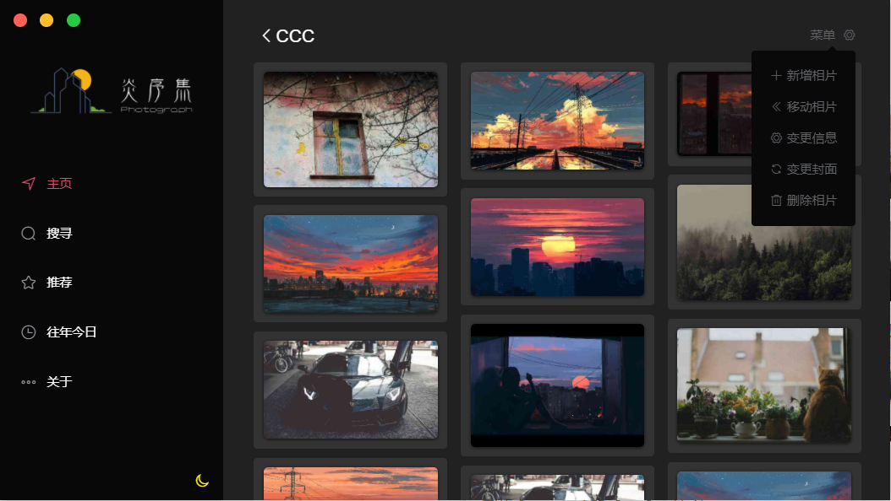
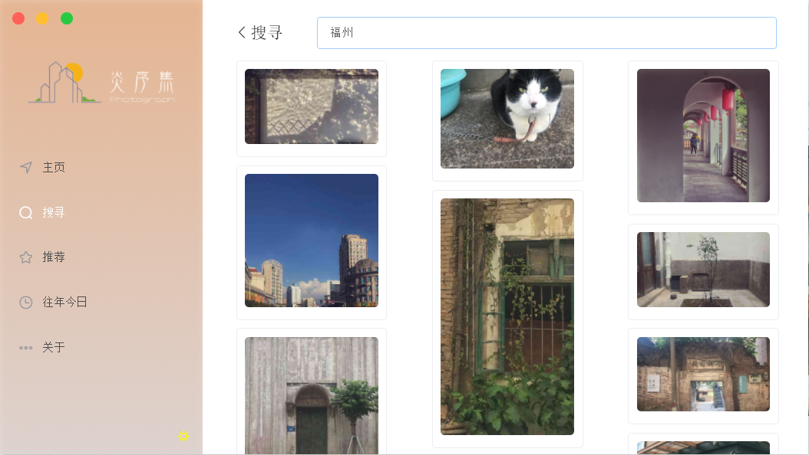
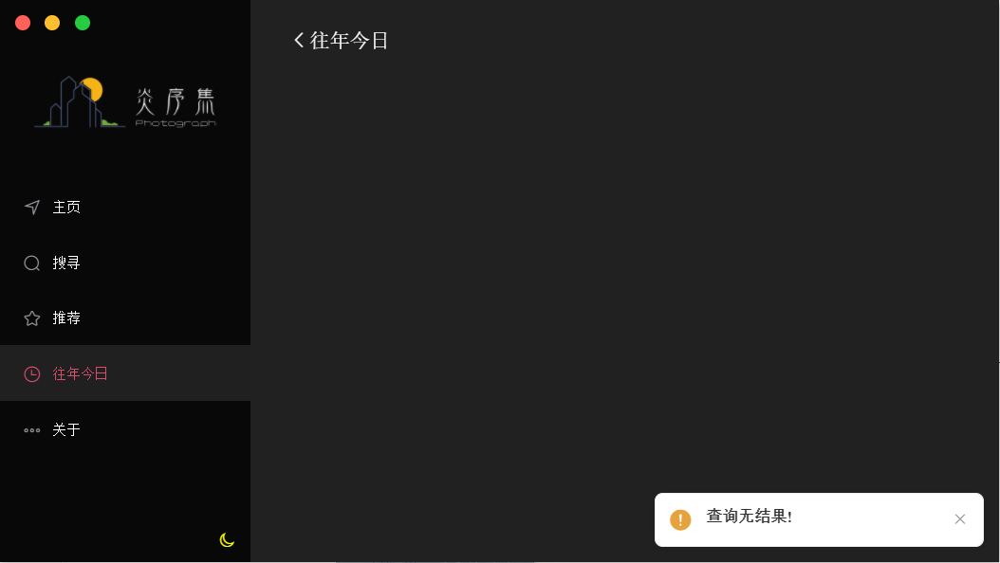
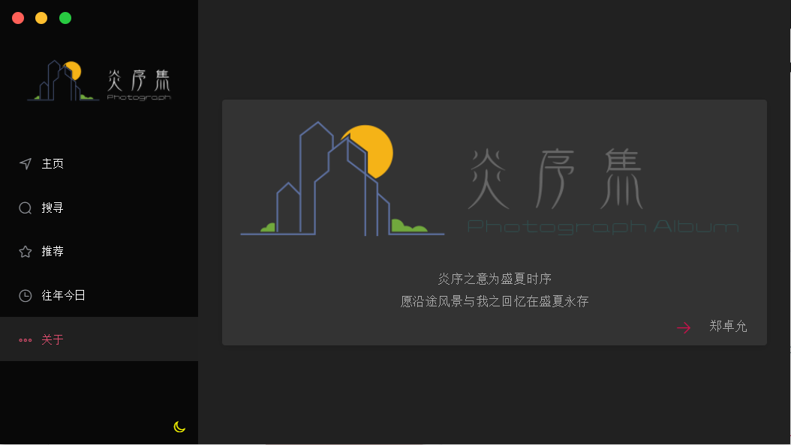

# yanxuji -- 炎序集


## 序

> 愿沿途风景与我之回忆在盛夏永存


> 炎序集 -- 一个使用`electron`, `electron-vue` , `element-ui`与 高德地图(`vue-amap`) 开发的相册项目
>
> `yanxuji` -- An `electron-vue` photo album project
>
> Node服务端 -- https://github.com/SunjianZheng/electron-vue-yanxuji-serverside


## Getting started

```shell
# clone the project
git@github.com:SunjianZheng/electron-vue-yanxuji.git

# enter the project directory
cd yanxuji

# install dependency
npm install or yarn

# develop
npm run dev
```


## Build

```shell
npm run build
```


## Pack

```shell
npm run pack
```


## 主要功能

- [x] 新建/删除相册 
- [x] 新增/删除相片  
- [x] 修改相册信息
- [x] 移动相片位置
- [x] 变更相册封面
- [x] 修改相册信息
- [x] 相片EXIF读取
- [ ] 相片EXIF修改
- [x] 原图下载
- [x] 根据实际搜寻相片
- [x] 根据地点搜寻相片
- [x] 往年今日
- [x] 年度相片集合
- [x] 拍摄地点相片集合
- [ ] 登录/注册
- [ ] 社交平台分享
- [ ] 好友分享
- [x] nedb, vuex 缓存, 减少接口调用

## 界面预览

### 主页


> 暗黑模式


### 相册详情页



#### 新增相片

> 使用`element-ui`的`el-upload`标签


#### 移动相片到其它相册


#### 删除相片


### 图片详情页


### 搜寻页

> 目前只支持搜寻`时间`和`地点`
>
> 点击图片可进入`图片详情页



#### 搜寻时间

> 可具体 例如 `2019-10-1 14:23:51`


#### 搜寻地点

> 可具体 例如 `福建省厦门市思明区鹭江街道鹭江道`


### 推荐页

> 点击图片可进入图片详情页
>
> 按各个年度生成相册
>
> 按各个城市生成相册


### 往年今日页




### 关于页


