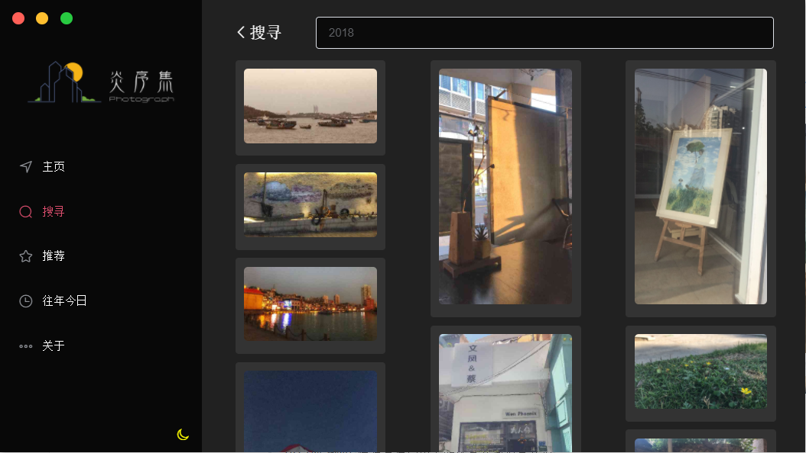
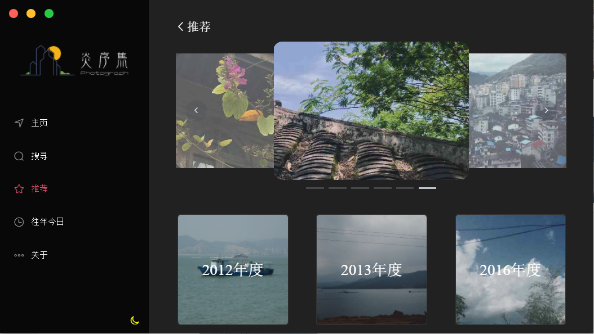

# yanxuji -- 炎序集


## 序

> 炎序之意为盛夏
>
> 愿沿途风景与我之回忆在盛夏永存


> 炎序集 -- 一个使用`electron`, `electron-vue` , `element-ui`与 高德地图(`vue-amap`) 开发的私人相册
>
> `yanxuji` -- An `electron-vue` photo album project
>
> Node服务端 -- https://github.com/SunjianZheng/electron-vue-yanxuji-serverside


## Getting started

```shell
# clone the project
git@github.com:SunjianZheng/electron-vue-yanxuji.git

# enter the project directory
cd yanxuji

# install dependency
npm install or yarn

# develop
npm run dev
```


## Build

```shell
npm run build
```


## Pack

```shell
npm run pack
```


## 界面预览

### 主页


#### 设置


#### 新增相册


#### 删除相册


### 相册详情页


#### 设置


#### 新增相片

> 使用`element-ui`的`el-upload`标签


#### 删除相片


### 图片详情页

#### 存在`exif`元信息并存在`GPS`标记


#### 存在`exif`元信息但不存在`GPS`标记


#### 无`exif`元信息


#### 点击预览原图


#### 原图下载


### 搜寻页

> 目前只支持搜寻`时间`和`地点`
>
> 点击图片可进入`图片详情页


#### 搜寻时间

> 可具体 例如 `2019-10-1 14:23:51`



#### 搜寻地点

> 可具体 例如 `福建省厦门市思明区鹭江街道鹭江道`


### 推荐页

> 点击图片可进入图片详情页




### 往年今日页

#### 若有记录


#### 若无记录


### 关于页


### 若断网

> 重连后会重新加载页面

